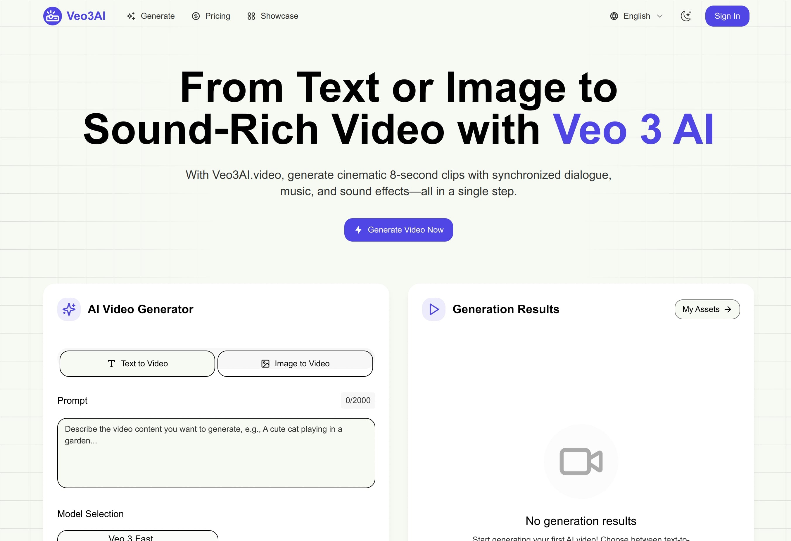

# Veo3AI.video - The Future of AI Video Generation is Here 🎬

**Turn your wildest ideas into stunning videos with sound in just minutes.** Powered by Google's revolutionary Veo 3 AI model, we're not just another video generator – we're the first platform that creates complete videos WITH synchronized audio, dialogue, and sound effects.

## Why Everyone's Talking About Veo 3 AI in 2025

Forget everything you know about AI video generators. While others leave you with silent clips that need hours of audio editing, **Veo3AI.video delivers the complete package**. Here's what makes us the best AI video generator of 2025:

### 🎵 World's First AI Video Generator with Full Audio
- **Natural dialogue** with perfect lip-sync
- **Cinematic soundtracks** that match your mood
- **Realistic sound effects** for every scene
- **Ambient audio** that brings your videos to life

### ⚡ Lightning-Fast Creation
Transform text to video or image to video in 5-10 minutes. No complex workflows, no technical expertise required – just pure creative magic.

### 🎯 Cinema-Grade Quality
Every video comes out in crisp **1080p HD** with realistic physics, smooth camera movements, and broadcast-ready quality that rivals professional studios.

## What You Can Create

**Content Creators**: Turn your ideas into viral TikToks, YouTube shorts, or Instagram reels with engaging audio that keeps viewers hooked.

**Marketing Teams**: Create product demos, advertisements, and brand stories that actually convert – complete with professional narration and background music.

**Filmmakers**: Prototype your next masterpiece, create stunning B-roll, or produce entire short films on an indie budget.

**Educators**: Build engaging course content with clear narration and visual storytelling that makes learning irresistible.

## Getting Started is Ridiculously Easy

1. **Sign up** at [veo3ai.video](https://veo3ai.video) and get 10 free credits
2. **Choose your mode**: Text to video or image to video
3. **Describe your vision** or upload your image
4. **Watch the magic happen** as Veo 3 creates your video with audio
5. **Download and share** your masterpiece in HD quality

## Features That Actually Matter

- ✅ **Text to Video**: Turn any description into a full video with audio
- ✅ **Image to Video**: Animate your photos with realistic motion and sound
- ✅ **Perfect Lip-Sync**: Characters speak naturally without the uncanny valley effect
- ✅ **Professional Camera Work**: Get drone shots, close-ups, and cinematic movements
- ✅ **Multi-Language Support**: Create content for global audiences
- ✅ **Commercial Rights**: Use your videos for business without restrictions
- ✅ **No Watermarks**: Clean, professional output every time

## Pricing That Makes Sense

Start creating for **free** with 10 credits, then choose a plan that fits your creative ambitions:

- **Starter**: $19.9/month (~15 videos)
- **Standard**: $39.9/month (~36 videos) ⭐ Most Popular
- **Premium**: $79.9/month (~80 videos)

*Finally, professional video production that doesn't break the bank.*

## Technical Specs for the Curious

- **AI Model**: Google Veo 3 (latest generation)
- **Video Quality**: Up to 1080p HD
- **Frame Rate**: Smooth 24-30fps
- **Audio**: Full spectrum with voice, SFX, and music
- **Duration**: Up to 8 seconds per generation
- **Formats**: Multiple aspect ratios supported

## Community & Support

- 🌐 **Website**: [veo3ai.video](https://veo3ai.video)
- 📧 **Support**: support@veo3ai.video
- 🎥 **Showcase**: [See amazing examples](https://veo3ai.video/showcase)
- 💰 **Pricing**: [Compare plans](https://veo3ai.video/pricing)

## The Bottom Line

In 2025, while others are still figuring out how to make AI videos look decent, **Veo3AI.video is already delivering the complete package** – stunning visuals AND professional audio in one go. 

Whether you're a solo creator looking to go viral or a marketing team wanting to scale video production, we're not just another tool in your kit. We're the upgrade that makes everything else obsolete.

**Ready to see what's possible?** [Start creating for free](https://veo3ai.video) and join thousands of creators who've discovered why Veo 3 AI is the future of video generation.

---

*Built with ❤️ by creators, for creators. Powered by Google's Veo 3 AI technology.*
